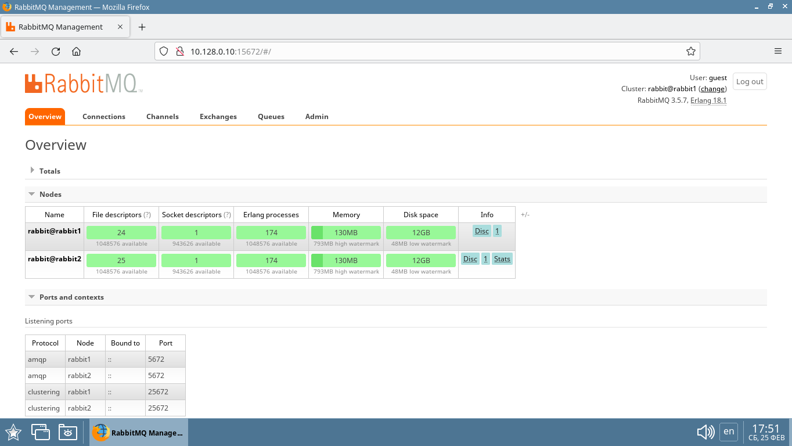
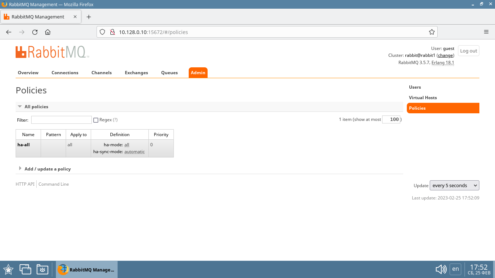
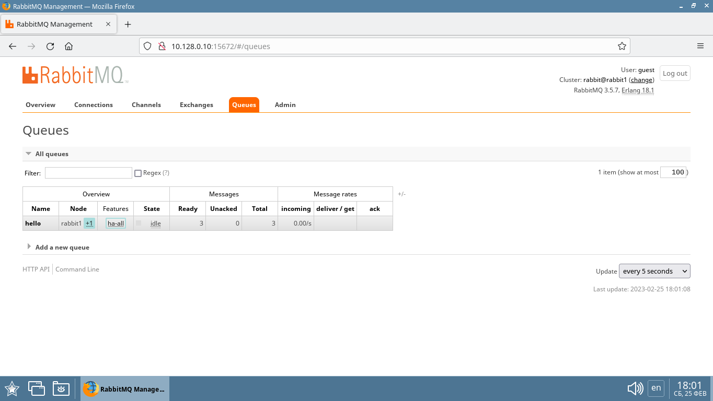
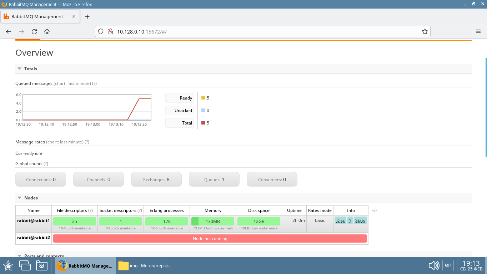
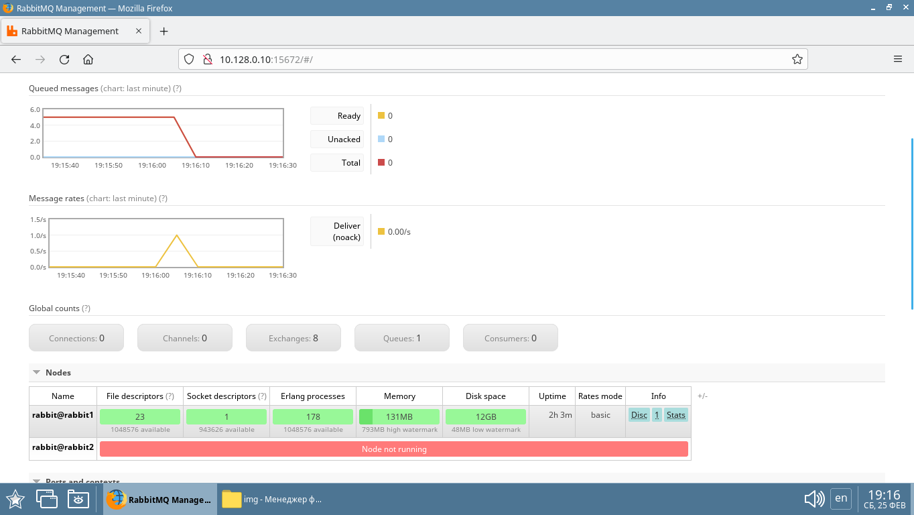
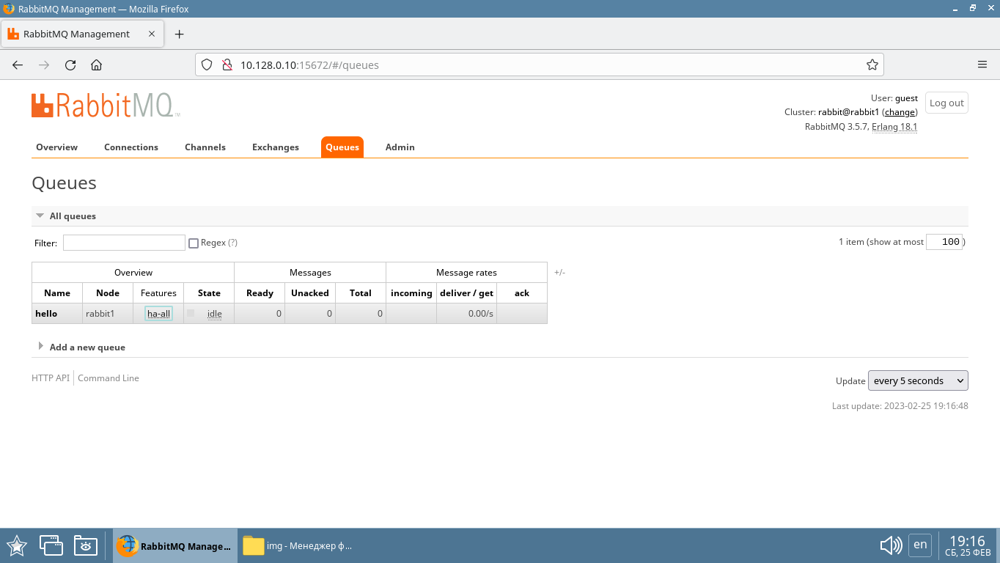
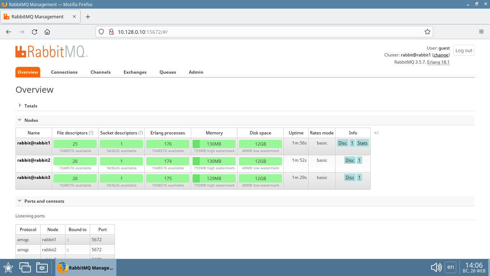
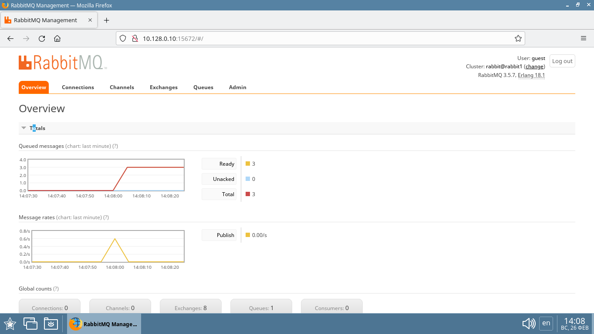
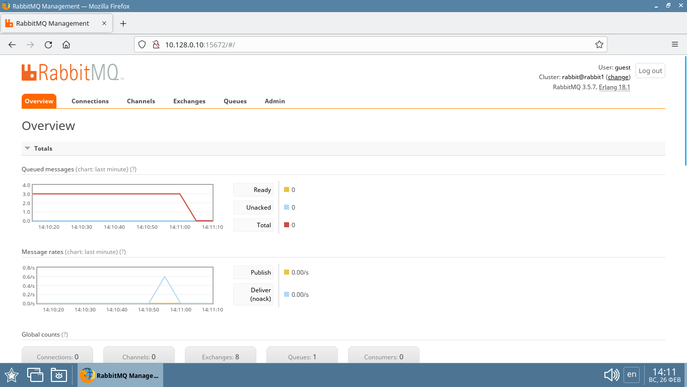
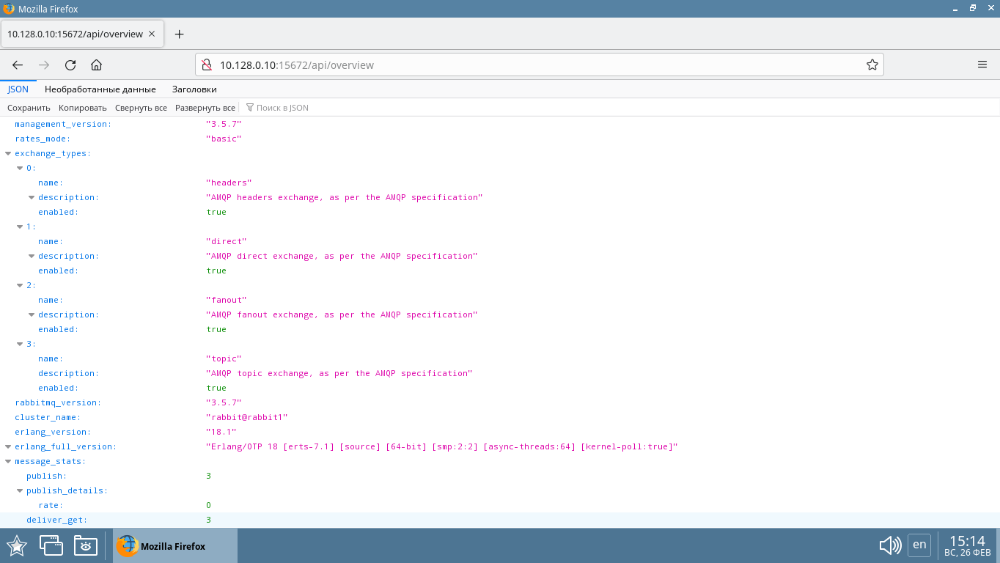

# Домашнее задание к занятию 11.4. «Очереди RabbitMQ» - `Елена Махота`

* [Ответ к Заданию 1](#1)
* [Ответ к Заданию 2](#2)
* [Ответ к Заданию 3](#3)
* [Ответ к Заданию 4*](#4)

---

### Задание 1. Установка RabbitMQ

Используя Vagrant или VirtualBox, создайте виртуальную машину и установите RabbitMQ.
Добавьте management plug-in и зайдите в веб-интерфейс.

*Итогом выполнения домашнего задания будет приложенный скриншот веб-интерфейса RabbitMQ.*

### <a name="1">*Ответ к Заданию 1*</a>

Создаем две виртуальных машины с помощью терраформ

[terraform/main.tf](terraform/main.tf)

```bash
// Create several similar vm 

// Configure the Yandex Cloud provider

terraform {
  required_providers {
    yandex = {
      source = "yandex-cloud/yandex"
    }
  }
}

provider "yandex" {
  token     = var.OAuthTocken
  cloud_id  = "b1gob4asoo1qa32tbt9b"
  folder_id = "b1gob4asoo1qa32tbt9b"
  zone      = "ru-central1-a"
}


  
//create vm

resource "yandex_compute_instance" "vm" {
  name = "${var.guest_name_prefix}-vm1${count.index}" #variables.tf 
  count = 2


  resources {
    cores     = 2
    memory    = 2
  
  }

  boot_disk {
    initialize_params {
      image_id = "fd8a67rb91j689dqp60h" #Debian 11
      type     = "network-ssd"
      size     = "16"
    }
  }

  network_interface {
    subnet_id = "e9bf0qhr78eltofkhvbb"
    nat       = true
    ip_address     = "10.128.0.1${count.index}"
    #ip_address     = lookup(var.vm_ips, count.index) #terraform.tfvars
    }

 
  metadata = {
    user-data = "${file("./meta.txt")}"
  }

  scheduling_policy {
    preemptible = true
  }

  # Copy in the bash script we want to execute.
  # The source is the location of the bash script
  # on the local linux box you are executing terraform
  # from.  The destination is on the new  instance.
  provisioner "file" {
    source      = "/home/user/terraform/checked-versions/RabbitMQ"
    destination = "/home/user/RabbitMQ"
  }  
  
  connection {
    host = "10.128.0.1${count.index}"
    type        = "ssh"
    private_key = "${file("~/.ssh/id_rsa")}"
    port        = 22
    user        = "user"
    agent       = false
    timeout     = "1m"
  }

  # Change name and permissions on bash script and execute from user.

  provisioner "remote-exec" {
    
    inline = [
      "sudo hostnamectl set-hostname ${var.guest_name_prefix}-vm1${count.index}",
      "sudo timedatectl set-timezone Europe/Moscow",
      "sudo sed -i '$a127.0.0.1 ${var.guest_name_prefix}-vm1${count.index}' /etc/hosts",
      "chmod +x /home/user/RabbitMQ/docker.sh",
      "sudo /home/user/RabbitMQ/docker.sh",  # setup docker
      "sudo docker run -d --hostname ${var.guest_name_prefix}-vm1${count.index} --name rabbit-1${count.index} -p 5672:5672 -p 15672:15672 rabbitmq:3-management" # setup RabbitMQ
    ]  
  }
}
```

В процессе установки машин с помощью `provisioner "remote-exec"` устанавливается `docker`

[terraform/docker.sh](terraform/docker.sh)

```bash
#!/bin/bash
sudo apt-get remove docker docker-engine docker.io containerd runc

sudo apt update
sudo apt upgrade -y

sudo apt-get install \
    ca-certificates \
    curl \
    gnupg \
    lsb-release -y

#Add Docker’s official GPG key:


sudo mkdir -p /etc/apt/keyrings
curl -fsSL https://download.docker.com/linux/debian/gpg | sudo gpg --dearmor -o /etc/apt/keyrings/docker.gpg

#set up the repository:


echo \
"deb [arch=$(dpkg --print-architecture) signed-by=/etc/apt/keyrings/docker.gpg] https://download.docker.com/linux/debian \
$(lsb_release -cs) stable" | sudo tee /etc/apt/sources.list.d/docker.list > /dev/null

#granting read permission for the Docker public key file before updating the package index:


sudo chmod a+r /etc/apt/keyrings/docker.gpg


#Update the apt package index:


sudo apt-get update

sudo apt-get install docker-ce docker-ce-cli containerd.io docker-compose-plugin docker-compose -y

#Verify that the Docker Engine installation is successful by running the hello-world image:


sudo docker run hello-world


sudo systemctl enable docker
sudo systemctl start docker


#Add user group docker
sudo usermod -aG docker user

#newgrp docker

sudo systemctl restart docker
```

В процессе установки машин ставится RabbitMQ в контейнерах c веб-интерфесом

```bash
sudo docker run -d --hostname makhota-vm10 --name rabbit-10 -p 5672:5672 -p 15672:15672 rabbitmq:3-management
```

```bash
sudo docker run -d --hostname makhota-vm11 --name rabbit-11 -p 5672:5672 -p 15672:15672 rabbitmq:3-management
```

Скриншоты веб-интерфейса RabbitMQ:


Логин и пароль по умолчанию для входа в веб-интерфейс `guest`


---

### Задание 2. Отправка и получение сообщений

Используя приложенные скрипты, проведите тестовую отправку и получение сообщения.
Для отправки сообщений необходимо запустить скрипт producer.py.

Для работы скриптов вам необходимо установить Python версии 3 и библиотеку Pika.
Также в скриптах нужно указать IP-адрес машины, на которой запущен RabbitMQ, заменив localhost на нужный IP.

```shell script
$ pip install pika
```

Зайдите в веб-интерфейс, найдите очередь под названием hello и сделайте скриншот.
После чего запустите второй скрипт consumer.py и сделайте скриншот результата выполнения скрипта

*В качестве решения домашнего задания приложите оба скриншота, сделанных на этапе выполнения.*

Для закрепления материала можете попробовать модифицировать скрипты, чтобы поменять название очереди и отправляемое сообщение.

### <a name="2">*Ответ к Заданию 2*</a>

Устанавливаем Python версии 3 и библиотеку Pika

```bash
sudo apt-get install python3 python3-pip
sudo pip install pika
```

Запускаем срипт [py/producer.py](py/producer.py)

```pyton3
#!/usr/bin/env python
# coding=utf-8
import pika

connection = pika.BlockingConnection(pika.ConnectionParameters('10.128.0.10')) #ip
channel = connection.channel()
channel.queue_declare(queue='hello')
channel.basic_publish(exchange='', routing_key='hello', body='Hello Netology!')
connection.close()
```

```bash
user@makhota-vm10:~$ sudo python3 /home/user/RabbitMQ/producer.py 
user@makhota-vm10:~$ sudo python3 /home/user/RabbitMQ/producer.py 
user@makhota-vm10:~$ sudo python3 /home/user/RabbitMQ/producer.py 
user@makhota-vm10:~$ sudo python3 /home/user/RabbitMQ/producer.py 
```


Запускаем срипт [py/consumer.py](py/consumer.py)

```pyton3
#!/usr/bin/env python
# coding=utf-8
import pika

connection = pika.BlockingConnection(pika.ConnectionParameters('10.128.0.10')) #ip
channel = connection.channel()
channel.queue_declare(queue='hello')


def callback(ch, method, properties, body):
    print(" [x] Received %r" % body)


channel.basic_consume(queue='hello', on_message_callback=callback, auto_ack=True)
channel.start_consuming()
```

```bash
user@makhota-vm10:~$ sudo python3 /home/user/RabbitMQ/consumer.py 
 [x] Received b'Hello Netology!'
 [x] Received b'Hello Netology!'
 [x] Received b'Hello Netology!'
 [x] Received b'Hello Netology!'
 ```

 

 

---

### Задание 3. Подготовка HA кластера

Используя Vagrant или VirtualBox, создайте вторую виртуальную машину и установите RabbitMQ.
Добавьте в файл hosts название и IP-адрес каждой машины, чтобы машины могли видеть друг друга по имени.

Пример содержимого hosts файла:
```shell script
$ cat /etc/hosts
192.168.0.10 rmq01
192.168.0.11 rmq02
```
После этого ваши машины могут пинговаться по имени.

Затем объедините две машины в кластер и создайте политику ha-all на все очереди.

*В качестве решения домашнего задания приложите скриншоты из веб-интерфейса с информацией о доступных нодах в кластере и включённой политикой.*

Также приложите вывод команды с двух нод:

```shell script
$ rabbitmqctl cluster_status
```

Для закрепления материала снова запустите скрипт producer.py и приложите скриншот выполнения команды на каждой из нод:

```shell script
$ rabbitmqadmin get queue='hello'
```

После чего попробуйте отключить одну из нод, желательно ту, к которой подключались из скрипта, затем поправьте параметры подключения в скрипте consumer.py на вторую ноду и запустите его.

*Приложите скриншот результата работы второго скрипта.*

### <a name="3">*Ответ к Заданию 3*</a>


С использованием terraform создано две машины

[terraform/main.tf](terraform/main.tf)

`10.128.0.10`
`10.128.0.11`

Установлен RabbitMQ с помощью docker на `10.128.0.10`

```bash 
docker run --hostname rabbit1 \
--add-host rabbit1:10.128.0.10 \
--add-host rabbit2:10.128.0.11 \
--name rabbit \
-p 15672:15672 -p 4369:4369 -p 5672:5672 -p 5671:5671 -p 25672:25672 \
-e RABBITMQ_ERLANG_COOKIE='makhota-makhota' \
-d rabbitmq:3.5-management
```

Установлен RabbitMQ с помощью docker на `10.128.0.11`

```bash 
docker run --hostname rabbit2 \
--add-host rabbit1:10.128.0.10 \
--add-host rabbit2:10.128.0.11 \
--name rabbit \
-p 15672:15672 -p 4369:4369 -p 5672:5672 -p 5671:5671 -p 25672:25672 \
-e RABBITMQ_ERLANG_COOKIE='makhota-makhota' \
-d rabbitmq:3.5-management
```

C помощью опции `--add-host`  в файл hosts кадого контейнера при создании добавлены название и IP-адрес каждой ноды, чтобы они могли видеть друг друга по имени.

Stdout
```shell 
user@makhota-vm10:~$ docker exec rabbit cat /etc/hosts
127.0.0.1       localhost
::1     localhost ip6-localhost ip6-loopback
fe00::0 ip6-localnet
ff00::0 ip6-mcastprefix
ff02::1 ip6-allnodes
ff02::2 ip6-allrouters
10.128.0.10     rabbit1
10.128.0.11     rabbit2
172.17.0.2      rabbit1
```

После этого ноды могут пинговаться по имени.

```bash
user@makhota-vm10:~$ docker exec rabbit ping -c1 rabbit2
PING rabbit2 (10.128.0.11): 56 data bytes
64 bytes from 10.128.0.11: icmp_seq=0 ttl=62 time=5.429 ms
--- rabbit2 ping statistics ---
1 packets transmitted, 1 packets received, 0% packet loss
round-trip min/avg/max/stddev = 5.429/5.429/5.429/0.000 ms
```

Затем  две ноды объединены в кластер.

```bash
user@makhota-vm10:~$ docker exec rabbit rabbitmqctl stop_app
Stopping node rabbit@rabbit1 ...
user@makhota-vm10:~$ docker exec rabbit rabbitmqctl join_cluster rabbit@rabbit2
Clustering node rabbit@rabbit1 with rabbit@rabbit2 ...
user@makhota-vm10:~$ docker exec rabbit rabbitmqctl start_app
Starting node rabbit@rabbit1 ...
```




Создана политика ha-all на все очереди.

```bash
user@makhota-vm10:~$ docker exec rabbit rabbitmqctl set_policy ha-all "" '{"ha-mode":"all","ha-sync-mode":"automatic"}'
Setting policy "ha-all" for pattern [] to "{\"ha-mode\":\"all\",\"ha-sync-mode\":\"automatic\"}" with priority "0" ...
```




Вывод команды `rabbitmqctl cluster_status` с двух нод:

```shell 
user@makhota-vm10:~$ docker exec -it rabbit bash
root@rabbit1:/# rabbitmqctl cluster_status
Cluster status of node rabbit@rabbit1 ...
[{nodes,[{disc,[rabbit@rabbit1,rabbit@rabbit2]}]},
 {running_nodes,[rabbit@rabbit2,rabbit@rabbit1]},
 {cluster_name,<<"rabbit@rabbit1">>},
 {partitions,[]}]
root@rabbit1:/# exit

user@makhota-vm11:~$ docker exec rabbit rabbitmqctl cluster_status
Cluster status of node rabbit@rabbit2 ...
[{nodes,[{disc,[rabbit@rabbit1,rabbit@rabbit2]}]},
 {running_nodes,[rabbit@rabbit1,rabbit@rabbit2]},
 {cluster_name,<<"rabbit@rabbit1">>},
 {partitions,[]}]

```

Запушен скрипт producer.py на ноде `rabbit1`

```bash
user@makhota-vm10:~$ sudo python3 /home/user/RabbitMQ/producer.py
user@makhota-vm10:~$ sudo python3 /home/user/RabbitMQ/producer.py
user@makhota-vm10:~$ sudo python3 /home/user/RabbitMQ/producer.py
```




Установлен инструмент `rabbitmqadmin` на обеих нодах

```bash
wget https://raw.githubusercontent.com/rabbitmq/rabbitmq-management/v3.7.8/bin/rabbitmqadmin
chmod 777 rabbitmqadmin
sed -i 's|#!/usr/bin/env python|#!/usr/bin/env python3|' rabbitmqadmin
sudo cp rabbitmqadmin /usr/bin/
```

Проверка очередей на ноде `rabbit1`


Запушен скрипт producer.py на ноде `rabbit2`

```bash
user@makhota-vm11:~$ sudo python3 /home/user/RabbitMQ/producer.py
user@makhota-vm11:~$ sudo python3 /home/user/RabbitMQ/producer.py
```
Проверка очередей на ноде `rabbit2`


Отключена нода `rabbit2`

```bash
user@makhota-vm11:~$ docker stop rabbit
rabbit
```




Запущен [consumer.py](py/consumer.py) на ноде `rabbit1`







---

## Дополнительные задания (со звёздочкой*)
Эти задания дополнительные, то есть не обязательные к выполнению, и никак не повлияют на получение вами зачёта по этому домашнему заданию. Вы можете их выполнить, если хотите глубже шире разобраться в материале.

### * Задание 4. Ansible playbook

Напишите плейбук, который будет производить установку RabbitMQ на любое количество нод и объединять их в кластер.
При этом будет автоматически создавать политику ha-all.

*Готовый плейбук разместите в своём репозитории.*

### <a name="4">*Ответ к Заданию 4**</a>

Создано 3 машины с помошью терраформ с предустановленными `docker`, `pip`, `pika`

[ansible/hosts](ansible/hosts)


Создан Playbook для `ansible`

[ansible/playbookrabbitmq.yml](ansible/playbookrabbitmq.yml)

```yaml
- name: Play rabbitmq1
  hosts: rabbit1
  become: no
  tasks:
  
  - name: Run docker rabbit1 container
    docker_container:
      env:   
        RABBITMQ_ERLANG_COOKIE: 'makhota-makhota'
      hostname: rabbit1
      image: rabbitmq:3.5-management
      name: rabbit
      ports: 
        - "15672:15672"
        - "4369:4369"
        - "5672:5672"
        - "5671:5671"
        - "25672:25672"
      etc_hosts: 
        {
          rabbit1 : 10.128.0.10,
          rabbit2 : 10.128.0.11,
          rabbit3 : 10.128.0.12,
        }
        

      restart_policy: always
      state: started

- name: Play rabbitmq2
  hosts: rabbit2
  become: no
  tasks:
  
  - name: Run docker rabbit2 container
    docker_container:
      env:   
        RABBITMQ_ERLANG_COOKIE: 'makhota-makhota'
      hostname: rabbit2
      image: rabbitmq:3.5-management
      name: rabbit
      ports: 
        - "15672:15672"
        - "4369:4369"
        - "5672:5672"
        - "5671:5671"
        - "25672:25672"
      etc_hosts: 
        {
          rabbit1 : 10.128.0.10,
          rabbit2 : 10.128.0.11,
          rabbit3 : 10.128.0.12,
        }

      restart_policy: always
      state: started
  
  
  - name: Add rabbit2 to cluster
    community.docker.docker_container_exec:
      container: rabbit
      command: /bin/bash -c "rabbitmqctl stop_app ; rabbitmqctl join_cluster rabbit@rabbit1 ; rabbitmqctl start_app"
      chdir: /root
    register: result
    ignore_errors: true

  - name: Print stdout
    debug:
      var: result.stdout

- name: Play rabbitmq3
  hosts: rabbit3
  become: no
  tasks:
  
  - name: Run docker rabbit3 container
    docker_container:
      env:   
        RABBITMQ_ERLANG_COOKIE: 'makhota-makhota'
      hostname: rabbit3
      image: rabbitmq:3.5-management
      name: rabbit
      ports: 
        - "15672:15672"
        - "4369:4369"
        - "5672:5672"
        - "5671:5671"
        - "25672:25672"
      etc_hosts: 
        {
          rabbit1 : 10.128.0.10,
          rabbit2 : 10.128.0.11,
          rabbit3 : 10.128.0.12,
        }
      restart_policy: always
      state: started

  - name: Add rabbit3 to cluster
    community.docker.docker_container_exec:
      container: rabbit
      command: /bin/bash -c "rabbitmqctl stop_app ; rabbitmqctl join_cluster rabbit@rabbit1 ; rabbitmqctl start_app"
      chdir: /root
    register: result
    ignore_errors: true


  - name: Print stdout
    debug:
      var: result.stdout

- name: Play Policies
  hosts: rabbit1
  become: no
  tasks:
  
  
  - name: Add Policy
    command: docker exec rabbit rabbitmqctl set_policy ha-all "" '{"ha-mode":"all","ha-sync-mode":"automatic"}'
    register: result
    ignore_errors: true

  - name: Print stdout
    debug:
      var: result.stdout

```

### Тестирование

```bash
user@makhotaev:~/ansible$ (master)ansible all -m ping
10.128.0.12 | SUCCESS => {
    "changed": false,
    "ping": "pong"
}
10.128.0.10 | SUCCESS => {
    "changed": false,
    "ping": "pong"
}
10.128.0.11 | SUCCESS => {
    "changed": false,
    "ping": "pong"
}
user@makhotaev:~/ansible$ (master)ansible all -m shell -a 'docker ps'
10.128.0.12 | CHANGED | rc=0 >>
CONTAINER ID   IMAGE     COMMAND   CREATED   STATUS    PORTS     NAMES
10.128.0.10 | CHANGED | rc=0 >>
CONTAINER ID   IMAGE     COMMAND   CREATED   STATUS    PORTS     NAMES
10.128.0.11 | CHANGED | rc=0 >>
CONTAINER ID   IMAGE     COMMAND   CREATED   STATUS    PORTS     NAMES
user@makhotaev:~/ansible$ (master)ansible-playbook playbookrabbitmq.yml 
[WARNING]: ansible.utils.display.initialize_locale has not been called, this may result in incorrectly calculated text widths that can cause Display to
print incorrect line lengths

PLAY [Play rabbitmq1] ***********************************************************************************************************************************

TASK [Gathering Facts] **********************************************************************************************************************************
ok: [10.128.0.10]

TASK [Run docker rabbit1 container] *********************************************************************************************************************
changed: [10.128.0.10]

PLAY [Play rabbitmq2] ***********************************************************************************************************************************

TASK [Gathering Facts] **********************************************************************************************************************************
ok: [10.128.0.11]

TASK [Run docker rabbit2 container] *********************************************************************************************************************
changed: [10.128.0.11]

TASK [Add rabbit2 to cluster] ***************************************************************************************************************************
changed: [10.128.0.11]

TASK [Print stdout] *************************************************************************************************************************************
ok: [10.128.0.11] => {
    "result.stdout": "Stopping node rabbit@rabbit2 ...\nClustering node rabbit@rabbit2 with rabbit@rabbit1 ...\nStarting node rabbit@rabbit2 ..."
}

PLAY [Play rabbitmq3] ***********************************************************************************************************************************

TASK [Gathering Facts] **********************************************************************************************************************************
ok: [10.128.0.12]

TASK [Run docker rabbit3 container] *********************************************************************************************************************
changed: [10.128.0.12]

TASK [Add rabbit3 to cluster] ***************************************************************************************************************************
changed: [10.128.0.12]

TASK [Print stdout] *************************************************************************************************************************************
ok: [10.128.0.12] => {
    "result.stdout": "Stopping node rabbit@rabbit3 ...\nClustering node rabbit@rabbit3 with rabbit@rabbit1 ...\nStarting node rabbit@rabbit3 ..."
}

PLAY [Play Policies] ************************************************************************************************************************************

TASK [Gathering Facts] **********************************************************************************************************************************
ok: [10.128.0.10]

TASK [Add Policy] ***************************************************************************************************************************************
changed: [10.128.0.10]

TASK [Print stdout] *************************************************************************************************************************************
ok: [10.128.0.10] => {
    "result.stdout": "Setting policy \"ha-all\" for pattern [] to \"{\\\"ha-mode\\\":\\\"all\\\",\\\"ha-sync-mode\\\":\\\"automatic\\\"}\" with priority \"0\" ..."
}

PLAY RECAP **********************************************************************************************************************************************
10.128.0.10                : ok=5    changed=2    unreachable=0    failed=0    skipped=0    rescued=0    ignored=0   
10.128.0.11                : ok=4    changed=2    unreachable=0    failed=0    skipped=0    rescued=0    ignored=0   
10.128.0.12                : ok=4    changed=2    unreachable=0    failed=0    skipped=0    rescued=0    ignored=0   

user@makhotaev:~/ansible$ (master)ansible all -m shell -a 'docker ps'
10.128.0.12 | CHANGED | rc=0 >>
CONTAINER ID   IMAGE                     COMMAND                  CREATED          STATUS          PORTS                                                                                                                     NAMES
91242a1b5b5a   rabbitmq:3.5-management   "/docker-entrypoint.…"   31 seconds ago   Up 30 seconds   0.0.0.0:4369->4369/tcp, 0.0.0.0:5671-5672->5671-5672/tcp, 0.0.0.0:15672->15672/tcp, 0.0.0.0:25672->25672/tcp, 15671/tcp   rabbit
10.128.0.10 | CHANGED | rc=0 >>
CONTAINER ID   IMAGE                     COMMAND                  CREATED          STATUS          PORTS                                                                                                                     NAMES
306661fa2987   rabbitmq:3.5-management   "/docker-entrypoint.…"   53 seconds ago   Up 52 seconds   0.0.0.0:4369->4369/tcp, 0.0.0.0:5671-5672->5671-5672/tcp, 0.0.0.0:15672->15672/tcp, 0.0.0.0:25672->25672/tcp, 15671/tcp   rabbit
10.128.0.11 | CHANGED | rc=0 >>
CONTAINER ID   IMAGE                     COMMAND                  CREATED          STATUS          PORTS                                                                                                                     NAMES
55d0184caf8b   rabbitmq:3.5-management   "/docker-entrypoint.…"   51 seconds ago   Up 50 seconds   0.0.0.0:4369->4369/tcp, 0.0.0.0:5671-5672->5671-5672/tcp, 0.0.0.0:15672->15672/tcp, 0.0.0.0:25672->25672/tcp, 15671/tcp   rabbit
user@makhotaev:~/ansible$ (master)ansible all -m shell -a 'docker exec rabbit rabbitmqctl cluster_status'
10.128.0.12 | CHANGED | rc=0 >>
Cluster status of node rabbit@rabbit3 ...
[{nodes,[{disc,[rabbit@rabbit1,rabbit@rabbit2,rabbit@rabbit3]}]},
 {running_nodes,[rabbit@rabbit1,rabbit@rabbit2,rabbit@rabbit3]},
 {cluster_name,<<"rabbit@rabbit1">>},
 {partitions,[]}]
10.128.0.11 | CHANGED | rc=0 >>
Cluster status of node rabbit@rabbit2 ...
[{nodes,[{disc,[rabbit@rabbit1,rabbit@rabbit2,rabbit@rabbit3]}]},
 {running_nodes,[rabbit@rabbit3,rabbit@rabbit1,rabbit@rabbit2]},
 {cluster_name,<<"rabbit@rabbit1">>},
 {partitions,[]}]
10.128.0.10 | CHANGED | rc=0 >>
Cluster status of node rabbit@rabbit1 ...
[{nodes,[{disc,[rabbit@rabbit1,rabbit@rabbit2,rabbit@rabbit3]}]},
 {running_nodes,[rabbit@rabbit3,rabbit@rabbit2,rabbit@rabbit1]},
 {cluster_name,<<"rabbit@rabbit1">>},
 {partitions,[]}]
user@makhotaev:~/ansible$ (master)ansible all -m shell -a 'python3 /home/user/RabbitMQ/producer.py' -b
10.128.0.10 | CHANGED | rc=0 >>

10.128.0.11 | CHANGED | rc=0 >>

10.128.0.12 | CHANGED | rc=0 >>

user@makhotaev:~/ansible$ (master)ansible all -m shell -a 'python3 /home/user/RabbitMQ/consumer.py &' -b
10.128.0.10 | CHANGED | rc=0 >>

10.128.0.12 | CHANGED | rc=0 >>

10.128.0.11 | CHANGED | rc=0 >>
```








