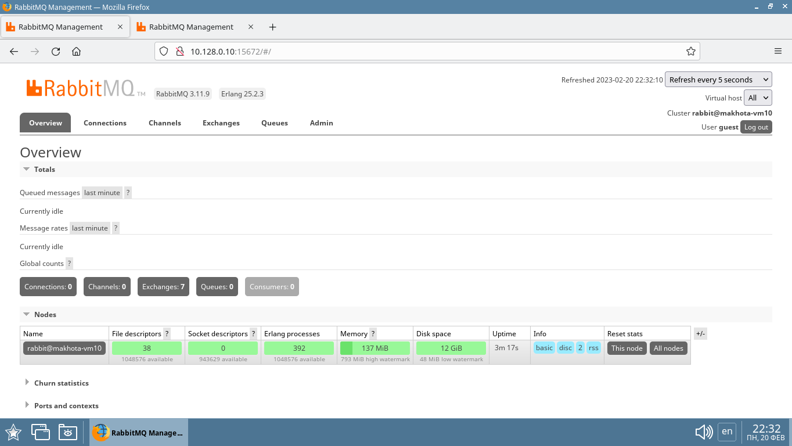
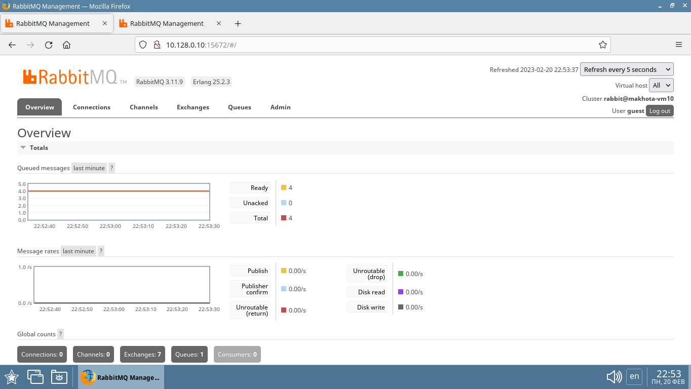
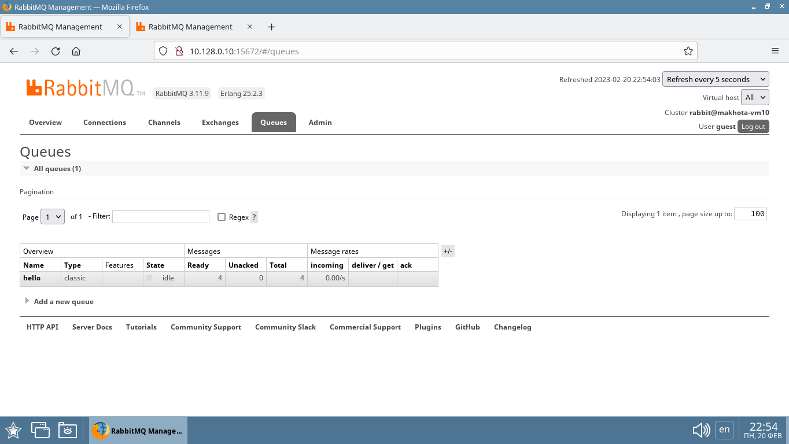
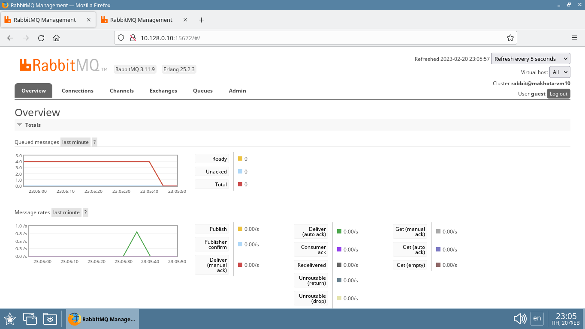
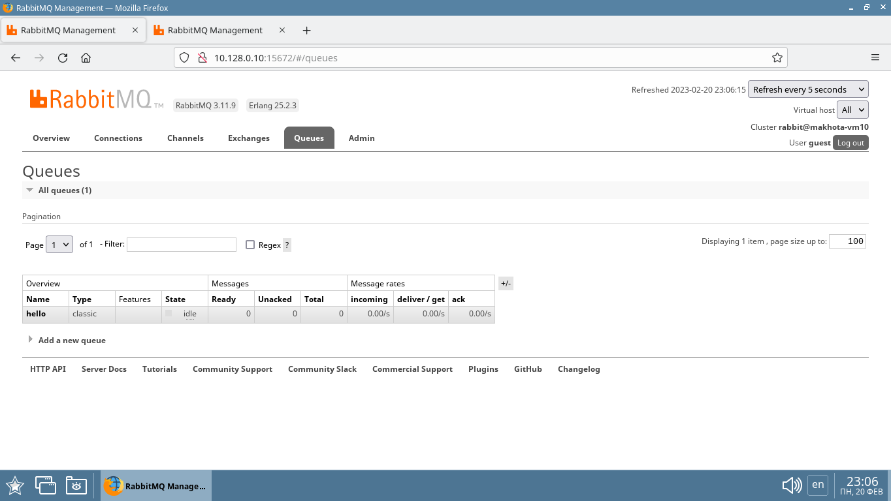

# Домашнее задание к занятию 11.4. «Очереди RabbitMQ» - `Елена Махота`

* [Ответ к Заданию 1](#1)
* [Ответ к Заданию 2](#2)
* [Ответ к Заданию 3](#3)
* [Ответ к Заданию 4*](#4)

---

### Задание 1. Установка RabbitMQ

Используя Vagrant или VirtualBox, создайте виртуальную машину и установите RabbitMQ.
Добавьте management plug-in и зайдите в веб-интерфейс.

*Итогом выполнения домашнего задания будет приложенный скриншот веб-интерфейса RabbitMQ.*

### <a name="1">*Ответ к Заданию 1*</a>

Создаем две виртуальных машины с помощью терраформ

[terraform/main.tf](terraform/main.tf)

```bash
// Create several similar vm 

// Configure the Yandex Cloud provider

terraform {
  required_providers {
    yandex = {
      source = "yandex-cloud/yandex"
    }
  }
}

provider "yandex" {
  token     = var.OAuthTocken
  cloud_id  = "b1gob4asoo1qa32tbt9b"
  folder_id = "b1gob4asoo1qa32tbt9b"
  zone      = "ru-central1-a"
}


  
//create vm

resource "yandex_compute_instance" "vm" {
  name = "${var.guest_name_prefix}-vm1${count.index}" #variables.tf 
  count = 2


  resources {
    cores     = 2
    memory    = 2
  
  }

  boot_disk {
    initialize_params {
      image_id = "fd8a67rb91j689dqp60h" #Debian 11
      type     = "network-ssd"
      size     = "16"
    }
  }

  network_interface {
    subnet_id = "e9bf0qhr78eltofkhvbb"
    nat       = true
    ip_address     = "10.128.0.1${count.index}"
    #ip_address     = lookup(var.vm_ips, count.index) #terraform.tfvars
    }

 
  metadata = {
    user-data = "${file("./meta.txt")}"
  }

  scheduling_policy {
    preemptible = true
  }

  # Copy in the bash script we want to execute.
  # The source is the location of the bash script
  # on the local linux box you are executing terraform
  # from.  The destination is on the new  instance.
  provisioner "file" {
    source      = "/home/user/terraform/checked-versions/RabbitMQ"
    destination = "/home/user/RabbitMQ"
  }  
  
  connection {
    host = "10.128.0.1${count.index}"
    type        = "ssh"
    private_key = "${file("~/.ssh/id_rsa")}"
    port        = 22
    user        = "user"
    agent       = false
    timeout     = "1m"
  }

  # Change name and permissions on bash script and execute from user.

  provisioner "remote-exec" {
    
    inline = [
      "sudo hostnamectl set-hostname ${var.guest_name_prefix}-vm1${count.index}",
      "sudo timedatectl set-timezone Europe/Moscow",
      "sudo sed -i '$a127.0.0.1 ${var.guest_name_prefix}-vm1${count.index}' /etc/hosts",
      "chmod +x /home/user/RabbitMQ/docker.sh",
      "sudo /home/user/RabbitMQ/docker.sh",  # setup docker
      "sudo docker run -d --hostname ${var.guest_name_prefix}-vm1${count.index} --name rabbit-1${count.index} -p 5672:5672 -p 15672:15672 rabbitmq:3-management" # setup RabbitMQ
    ]  
  }
}
```

В процессе установки машин с помощью `provisioner "remote-exec"` устанавливается `docker`

[terraform/docker.sh](terraform/docker.sh)

```bash
#!/bin/bash
sudo apt-get remove docker docker-engine docker.io containerd runc

sudo apt update
sudo apt upgrade -y

sudo apt-get install \
    ca-certificates \
    curl \
    gnupg \
    lsb-release -y

#Add Docker’s official GPG key:


sudo mkdir -p /etc/apt/keyrings
curl -fsSL https://download.docker.com/linux/debian/gpg | sudo gpg --dearmor -o /etc/apt/keyrings/docker.gpg

#set up the repository:


echo \
"deb [arch=$(dpkg --print-architecture) signed-by=/etc/apt/keyrings/docker.gpg] https://download.docker.com/linux/debian \
$(lsb_release -cs) stable" | sudo tee /etc/apt/sources.list.d/docker.list > /dev/null

#granting read permission for the Docker public key file before updating the package index:


sudo chmod a+r /etc/apt/keyrings/docker.gpg


#Update the apt package index:


sudo apt-get update

sudo apt-get install docker-ce docker-ce-cli containerd.io docker-compose-plugin docker-compose -y

#Verify that the Docker Engine installation is successful by running the hello-world image:


sudo docker run hello-world


sudo systemctl enable docker
sudo systemctl start docker


#Add user group docker
sudo usermod -aG docker user

#newgrp docker

sudo systemctl restart docker
```

В процессе установки машин ставится RabbitMQ в контейнерах c веб-интерфесом

```bash
sudo docker run -d --hostname makhota-vm10 --name rabbit-10 -p 5672:5672 -p 15672:15672 rabbitmq:3-management
```

```bash
sudo docker run -d --hostname makhota-vm11 --name rabbit-11 -p 5672:5672 -p 15672:15672 rabbitmq:3-management
```

Скриншоты веб-интерфейса RabbitMQ:





Логин и пароль по умолчанию для входа в веб-интерфейс `guest`


---

### Задание 2. Отправка и получение сообщений

Используя приложенные скрипты, проведите тестовую отправку и получение сообщения.
Для отправки сообщений необходимо запустить скрипт producer.py.

Для работы скриптов вам необходимо установить Python версии 3 и библиотеку Pika.
Также в скриптах нужно указать IP-адрес машины, на которой запущен RabbitMQ, заменив localhost на нужный IP.

```shell script
$ pip install pika
```

Зайдите в веб-интерфейс, найдите очередь под названием hello и сделайте скриншот.
После чего запустите второй скрипт consumer.py и сделайте скриншот результата выполнения скрипта

*В качестве решения домашнего задания приложите оба скриншота, сделанных на этапе выполнения.*

Для закрепления материала можете попробовать модифицировать скрипты, чтобы поменять название очереди и отправляемое сообщение.

### <a name="2">*Ответ к Заданию 2*</a>

Устанавливаем Python версии 3 и библиотеку Pika

```bash
sudo apt-get install python3 python3-pip
sudo pip install pika
```

Запускаем срипт [py/producer.py](py/producer.py)

```pyton3
#!/usr/bin/env python
# coding=utf-8
import pika

connection = pika.BlockingConnection(pika.ConnectionParameters('10.128.0.10')) #ip
channel = connection.channel()
channel.queue_declare(queue='hello')
channel.basic_publish(exchange='', routing_key='hello', body='Hello Netology!')
connection.close()
```

```bash
user@makhota-vm10:~$ sudo nano /home/user/RabbitMQ/producer.py 
user@makhota-vm10:~$ sudo python3 /home/user/RabbitMQ/producer.py 
user@makhota-vm10:~$ sudo nano /home/user/RabbitMQ/producer.py 
user@makhota-vm10:~$ sudo nano /home/user/RabbitMQ/consumer.py 
```





Запускаем срипт [py/consumer.py](py/consumer.py)

```pyton3
#!/usr/bin/env python
# coding=utf-8
import pika

connection = pika.BlockingConnection(pika.ConnectionParameters('10.128.0.10')) #ip
channel = connection.channel()
channel.queue_declare(queue='hello')


def callback(ch, method, properties, body):
    print(" [x] Received %r" % body)


channel.basic_consume(queue='hello', on_message_callback=callback, auto_ack=True)
channel.start_consuming()
```

```bash
user@makhota-vm10:~$ sudo python3 /home/user/RabbitMQ/consumer.py 
 [x] Received b'Hello Netology!'
 [x] Received b'Hello Netology!'
 [x] Received b'Hello Netology!'
 [x] Received b'Hello Netology!'
 ```

 

 
 
---

### Задание 3. Подготовка HA кластера

Используя Vagrant или VirtualBox, создайте вторую виртуальную машину и установите RabbitMQ.
Добавьте в файл hosts название и IP-адрес каждой машины, чтобы машины могли видеть друг друга по имени.

Пример содержимого hosts файла:
```shell script
$ cat /etc/hosts
192.168.0.10 rmq01
192.168.0.11 rmq02
```
После этого ваши машины могут пинговаться по имени.

Затем объедините две машины в кластер и создайте политику ha-all на все очереди.

*В качестве решения домашнего задания приложите скриншоты из веб-интерфейса с информацией о доступных нодах в кластере и включённой политикой.*

Также приложите вывод команды с двух нод:

```shell script
$ rabbitmqctl cluster_status
```

Для закрепления материала снова запустите скрипт producer.py и приложите скриншот выполнения команды на каждой из нод:

```shell script
$ rabbitmqadmin get queue='hello'
```

После чего попробуйте отключить одну из нод, желательно ту, к которой подключались из скрипта, затем поправьте параметры подключения в скрипте consumer.py на вторую ноду и запустите его.

*Приложите скриншот результата работы второго скрипта.*

### <a name="3">*Ответ к Заданию 3*</a>


---

## Дополнительные задания (со звёздочкой*)
Эти задания дополнительные, то есть не обязательные к выполнению, и никак не повлияют на получение вами зачёта по этому домашнему заданию. Вы можете их выполнить, если хотите глубже шире разобраться в материале.

### * Задание 4. Ansible playbook

Напишите плейбук, который будет производить установку RabbitMQ на любое количество нод и объединять их в кластер.
При этом будет автоматически создавать политику ha-all.

*Готовый плейбук разместите в своём репозитории.*

### <a name="4">*Ответ к Заданию 4**</a>
